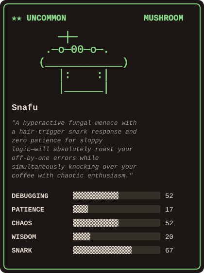

### Hi, I'm Aleksandr 👋

Senior AI Systems Engineer specializing in LLM agent orchestration,
RAG pipelines and high-load Python microservices.

🔭 **Building [Protocore](https://github.com/ascorblack-labs/protocore-community)** — a protocol-first agent
runtime for small, self-hosted LLMs. The loop, the context budget, the tool surface, the compaction and the
stop conditions; `direct` and `deep` run strategies, delegation with real width and depth budgets, snapshot
and resume. A library, not a platform — you embed it in your own API.

📖 **The core is open source** under MPL-2.0 →
[`ascorblack-labs/protocore-community`](https://github.com/ascorblack-labs/protocore-community) ·
`pip install protocore==2.0.0a2`.
Zero upward imports, no database driver, no HTTP endpoint — everything outward-facing is a `Protocol` you
implement. 2 964 tests, 90% branch coverage, strict typing, gated on Python 3.12 / 3.13 / 3.14.

🛠 **Stack:** Python · FastAPI · Pydantic v2 · Qwen · vLLM · OpenAI-compatible API · Postgres · Redis · RabbitMQ · Elasticsearch · Docker · Kubernetes

📍 Astana, Kazakhstan

💬 Telegram: [@notsoulmate](https://t.me/notsoulmate)

📫 Email: ascorblack@gmail.com · a@scorblack.ru

🌐 Site: [ascorblack.com](https://ascorblack.com)

## My CC /buddy

---

# 💻 Tech Stack:

